# aws-web-infrastructure
This project demonstrates how I built a highly available and scalable web infrastructure on AWS using services like VPC, EC2, Auto Scaling, and Application Load Balancer.

The setup is designed to distribute traffic across multiple EC2 instances and automatically recover from failures using Auto Scaling and AMI backups.

## Services Used
 - Amazon VPC
 - EC2 Instances
 - Security Groups
 - Application Load Balancer (ALB)
 - Route Tables
 - Internet Gateway
 - NAT Gateway
 - Public & Private Subnets
 - Auto Scaling Group
 - AMI (Amazon Machine Image)
 - EBS Snapshots

## Project Architecture
 - Created a custom VPC
 - Configured public and private subnets
 - Attached Internet Gateway for public access
 - Configured NAT Gateway to provide internet access for private subnets
 - Launched EC2 instances inside private subnets
 - Installed web server on EC2
 - Configured Application Load Balancer
 - Attached EC2 instances to Target Group
 - Configured Auto Scaling for high availability
 - Created AMI backup for disaster recovery testing
## Steps Performed

### 1. VPC and Networking Setup
- Created a custom VPC
- Created public and private subnets
- Configured route tables
- Attached Internet Gateway
- Configured NAT Gateway for private subnet internet access

### 2. EC2 Setup
- Launched EC2 instances inside private subnets
- Installed Apache web server on EC2 instances
- Created sample web pages

### 3. Security Configuration
- Created security groups for:
  - ALB
  - EC2 instances
- Allowed HTTP traffic from ALB to EC2
- Allowed SSH access from my IP

### 4. Load Balancer Setup
- Created Application Load Balancer
- Attached public subnets
- Registered EC2 instances with target group
- Verified traffic distribution between instances

### 5. Auto Scaling Setup
- Created Launch Template
- Configured Auto Scaling Group
- Enabled automatic replacement of failed EC2 instances

### 6. Disaster Recovery
- Created AMI backup
- Launched a new EC2 instance from AMI
- Verified recovery webpage

---
## Web Server Commands Used

```bash
sudo yum install httpd -y
sudo systemctl start httpd
sudo systemctl enable httpd

echo "<h1>Recovered EC2 Instance</h1>" | sudo tee /var/www/html/index.html
```
---

## Project Validation

- Verified ALB routing between multiple EC2 instances
- Tested Auto Scaling by terminating one instance
- Verified automatic replacement of failed instance
- Tested Disaster Recovery using AMI backup

---

## Screenshots

### VPC Setup
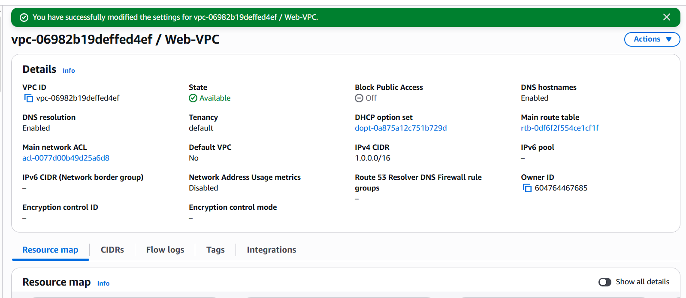

### Subnet Architecture
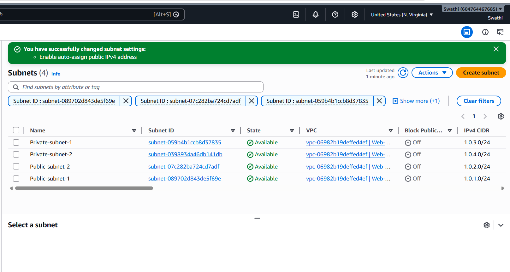

### Public Route Table with Internet Gateway
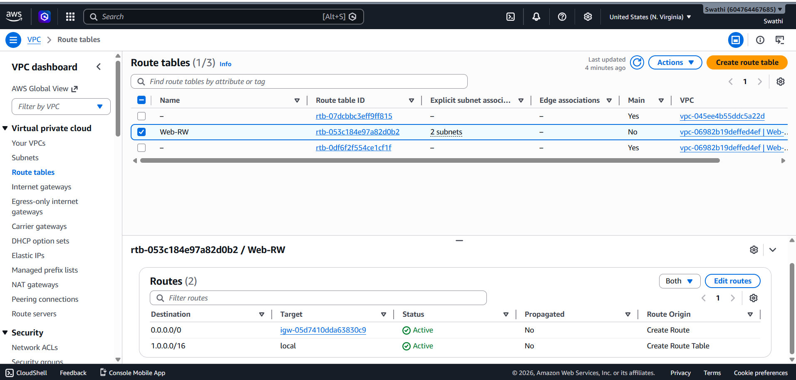

### Private Route Table with NAT Gateway
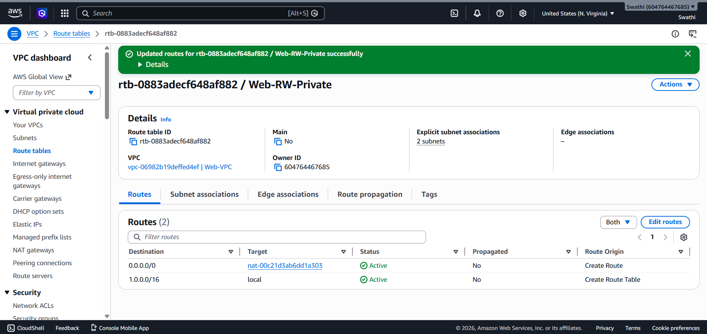

### Load Balancer Configuration
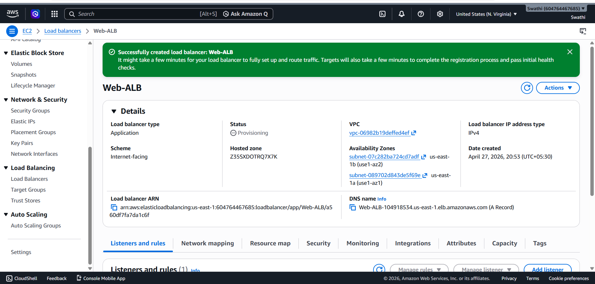

### EC2 Instances Running
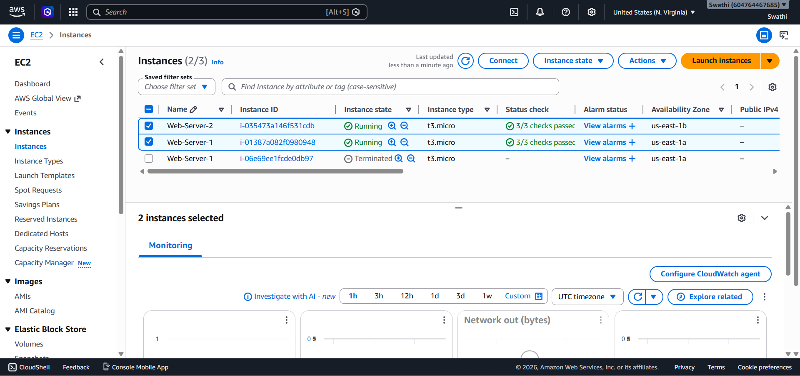

### ALB Routing - Instance 1
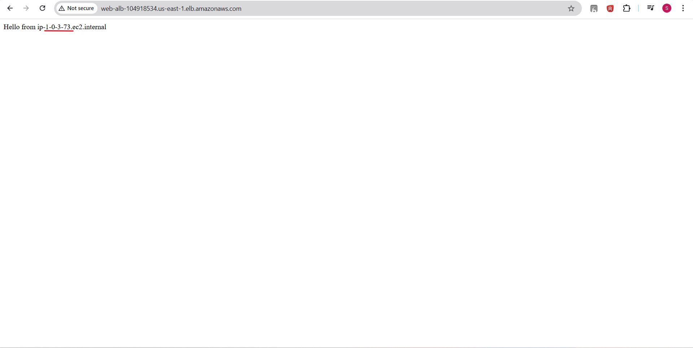

### ALB Routing - Instance 2
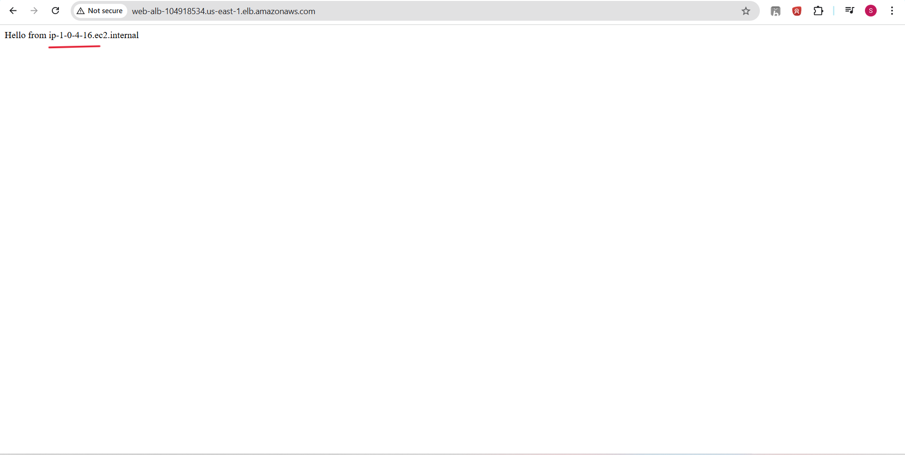

### Auto Scaling Self Healing
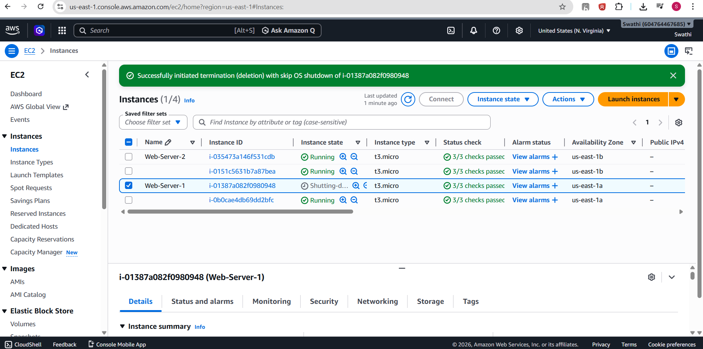

### Recovered EC2 Instance
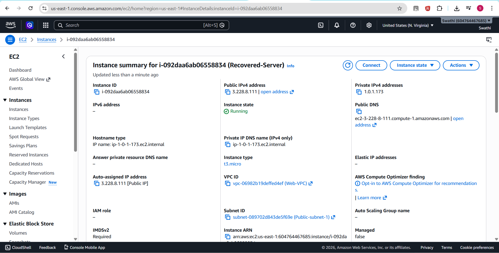

### Disaster Recovery Output
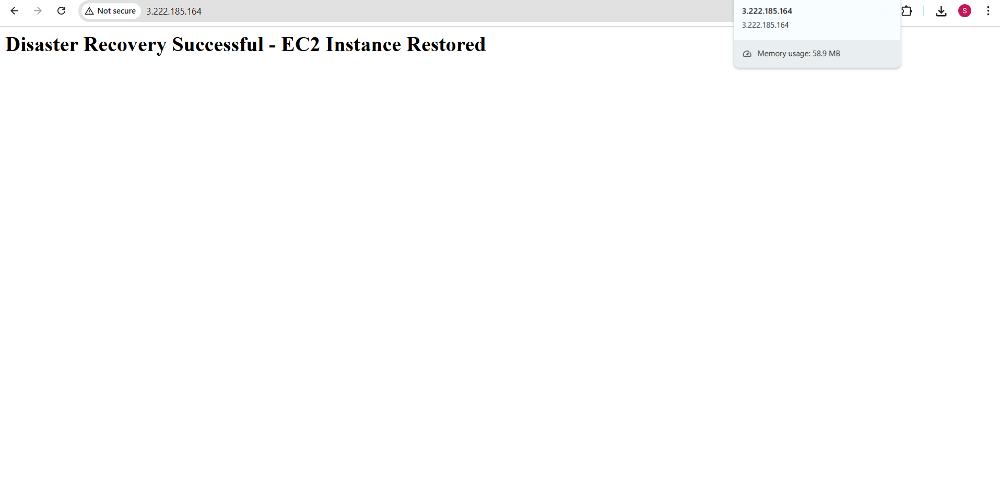

---

## Learning Outcome

Through this project, I learned:

- AWS networking concepts
- VPC and subnet configuration
- Load balancing concepts
- EC2 setup and troubleshooting
- Auto Scaling and self-healing infrastructure
- Disaster Recovery using AMI backups

---

## Future Improvements

- Add CloudWatch monitoring
- Configure HTTPS using ACM
- Implement CI/CD using GitHub Actions
- Deploy infrastructure using Terraform

---

## Author

**Swathi P** 

Cloud Engineer
